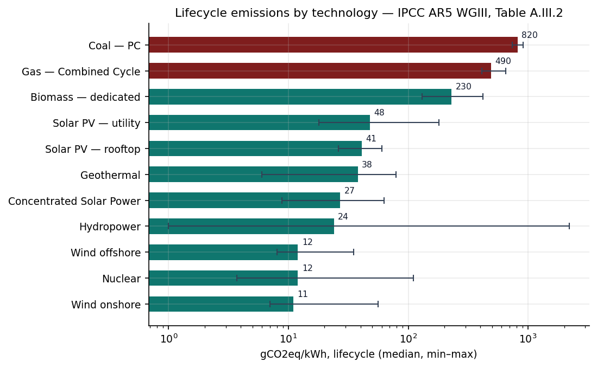
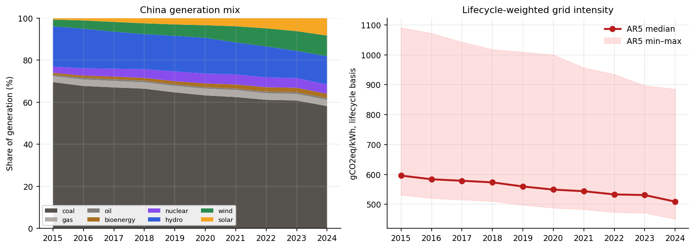
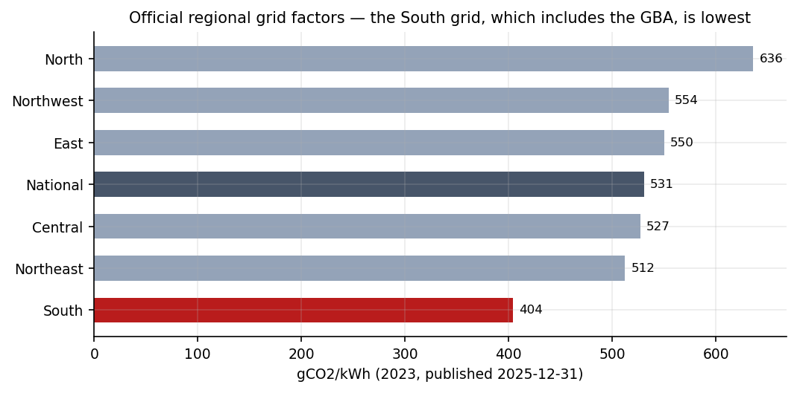
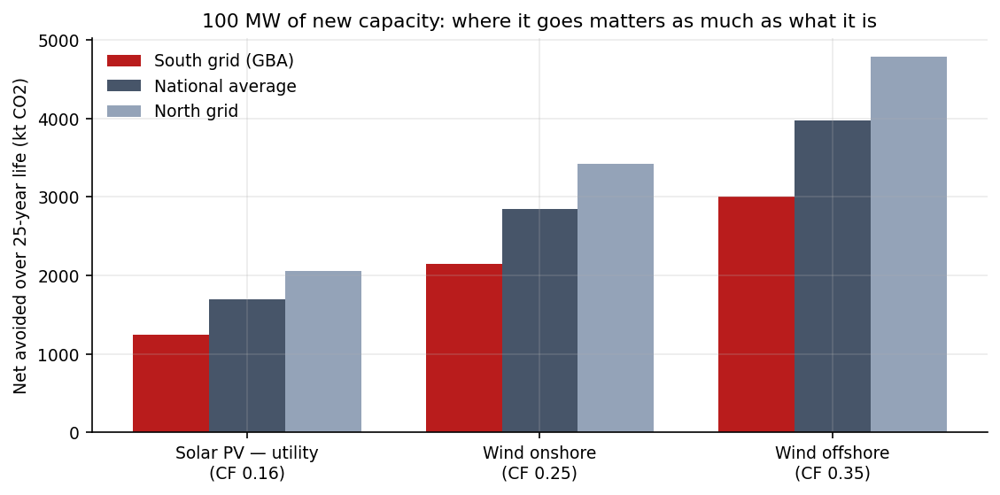
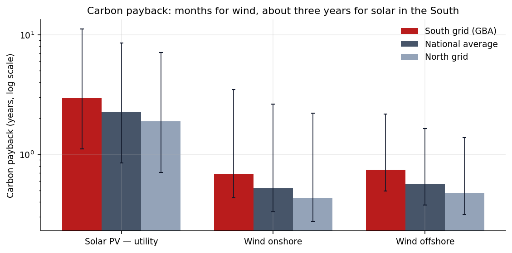

# Lifecycle carbon footprint of electricity, applied to China's grid

Lifecycle greenhouse gas emissions of eleven electricity technologies from the
IPCC's own table, applied to China's actual generation mix and to the official
regional grid factors — to answer where new renewable capacity avoids the most,
and how long it takes to pay back its own footprint.

## Key findings

- **Coal emits 820 gCO2eq/kWh over its lifecycle** — 75× onshore wind, 68×
  nuclear and 17× utility-scale solar (IPCC AR5 medians).
- **China's coal share of generation fell from 69.6% to 58.2% between 2015 and
  2024**, and the lifecycle-weighted grid intensity fell from 596 to 509
  gCO2eq/kWh, **−14.6%**.
- **The South grid, which includes the Greater Bay Area, has the lowest official
  factor in China**: 404 gCO2/kWh in 2023, 36% below the North grid's 636.
- **Where capacity goes matters as much as what it is.** 100 MW of utility solar
  avoids 49,925 t CO2 a year net in the South and 82,428 t in the North — 65%
  more for the same panels.
- **Carbon payback is months for wind and about three years for solar** in the
  South grid: utility solar 3.0 years (1.1–11 across AR5's range), onshore wind
  8 months.











The full analysis is in [`notebooks/analysis.ipynb`](notebooks/analysis.ipynb);
its conclusions are generated from the tables rather than written by hand.

## Data

| Input | Source | File |
|---|---|---|
| Lifecycle emissions, min / median / max, gCO2eq/kWh | IPCC AR5 WGIII Annex III (Schlömer et al., 2014), **Table A.III.2** | `data/ar5_lifecycle_emissions.csv` |
| Plant lifetimes | same annex, Table A.III.1 | same file |
| China's generation shares, 2015–2024 | [Our World in Data energy dataset](https://github.com/owid/energy-data), from Ember and the Energy Institute (CC BY 4.0) | `data/china_generation_mix_2015_2024.csv` |
| Regional grid emission factors, 2023 | 生态环境部、国家统计局，关于发布2023年电力二氧化碳排放因子的公告 (2025-12-31) | `data/mee_2023_grid_factors.csv` |

The AR5 values were transcribed from the annex PDF, whose SHA-256 is pinned in
`scripts/fetch_sources.py`; the grid factors carry the notice's URL and the
SHA-256 of its PDF. The PDFs themselves are not redistributed.

## How the numbers are made

- **Lifecycle, not operational.** AR5's figures include mining, fuel supply and
  methane leakage, so the lifecycle-weighted grid intensity runs higher than
  the official operational factor (0.5306 kg/kWh nationally in 2023). The two
  measure different things and are not compared directly.
- **Shares that sum to 100%.** Every source of generation is kept. Oil (0.6–0.9%
  of the mix) has no row in Table A.III.2, so it is excluded from the weighting
  and the covered share — 99.1–99.4% in every year — is reported alongside.
- **Mapping.** Wind uses the onshore value (11; offshore is 12), solar the
  utility-scale value (48; rooftop is 41, so this errs slightly high), bioenergy
  the dedicated-biomass value.
- **Avoided emissions** use the official average grid factor for the region
  and the technology's own lifecycle median. Capacity factors — solar 0.16,
  onshore wind 0.25, offshore 0.35 — are assumptions, each inside AR5's
  full-load-hour range for the technology. Tonnages scale with them; the ratio
  between regions does not depend on them.
- **Payback** is lifecycle intensity × plant lifetime ÷ displaced grid factor.
  Capacity factor cancels out. Lifetimes are AR5's: 25 years for solar and wind.

## What it does not show

- **Average, not marginal.** New capacity usually displaces fossil generation at
  the margin, which emits more than the grid average. Using the average factor
  understates what a new plant avoids, in every region alike.
- **AR5 is from 2014.** Solar manufacturing has since become less carbon-intensive
  per kWh, so today's solar figure is likely lower than 48. AR5 is used because it
  publishes a single, citable table with ranges for every technology; the ranges
  are shown everywhere a median is.
- **National technology factors.** AR5's values are global literature medians,
  not specific to Chinese supply chains.

## Running it

```bash
pip install -r requirements.txt

make test       # 19 tests pinning every input to its source
make notebook   # rerun the analysis and regenerate every figure
make sources    # optional: re-download the AR5 annex and the OWID dataset
```

## Layout

```
data/
  ar5_lifecycle_emissions.csv          Table A.III.2 and lifetimes from A.III.1
  china_generation_mix_2015_2024.csv   OWID / Ember / Energy Institute
  mee_2023_grid_factors.csv            official 2023 factors, with URL and SHA-256
  china_grid_intensity.csv             derived: lifecycle-weighted intensity by year
scripts/
  fetch_sources.py                     downloads the sources, checks the annex hash
  lca_calculation.py                   intensity, avoided emissions, payback
notebooks/analysis.ipynb               the analysis, executed
tests/                                 19 tests
outputs/                               figures
```

## Corrections in this version

An audit of the first version against its sources found errors that changed its
conclusions. All are fixed here, and each has a test that fails if it returns:

- The lifecycle values were attributed to IPCC **AR6**; they are **AR5**'s
  (AR6 does not publish this table).
- Utility-scale solar was given **41**, which is AR5's *rooftop* median; the
  utility-scale median is **48** (range 18–180). The nuclear and hydropower ranges
  are now as printed in Table A.III.2.
- A construction / fuel / operation / decommissioning breakdown had no source, and
  for coal, gas and offshore wind its parts did not add up to the totals. It has
  been removed; AR5's own component columns are in the data file instead.
- The generation shares summed to **95%** by 2024, which counted the missing
  generation as zero-emission and overstated the decline in grid intensity
  (**−22%**, against **−15%** on real shares). Coal's 2024 share is **58%**, not 54%.
  The mix is now OWID's.
- The regional grid factors did not match the official figures they were
  attributed to; the value labelled "South" (0.5271) is the Central grid's. They
  are now the official 2023 factors.
- Avoided emissions were reported **a thousand times too small** (a tonnes
  conversion error). Ratios between regions were unaffected, which is why the
  error went unnoticed.
- A 2030 scenario based on an assumed generation mix has been removed; China's
  2030 target is stated for primary energy, not electricity.

## Related repositories

- [green-ai-ledger](https://github.com/Zhaohh0706/green-ai-ledger) — compute energy and carbon, with the grid factor pinned rather than guessed
- [GBA-Air-Quality-Analysis](https://github.com/Zhaohh0706/GBA-Air-Quality-Analysis) — Greater Bay Area air quality 2015–2024 from CNEMC monitoring data
- [pv-wind-power-forecast](https://github.com/Zhaohh0706/pv-wind-power-forecast) — PV and wind forecasting, priced against Chinese grid-code assessment

## Licence

Code: MIT. Data: see the sources above.
